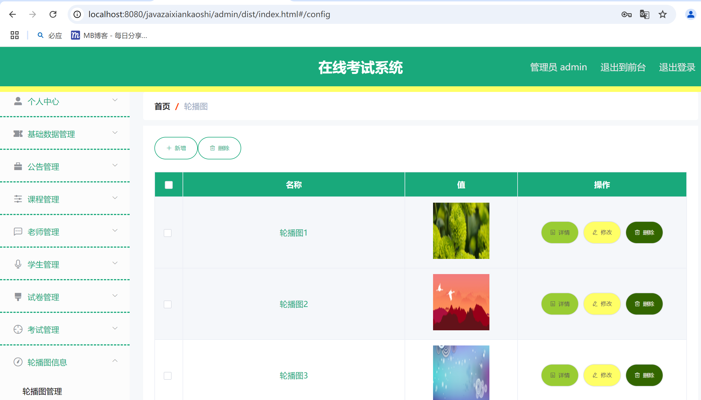
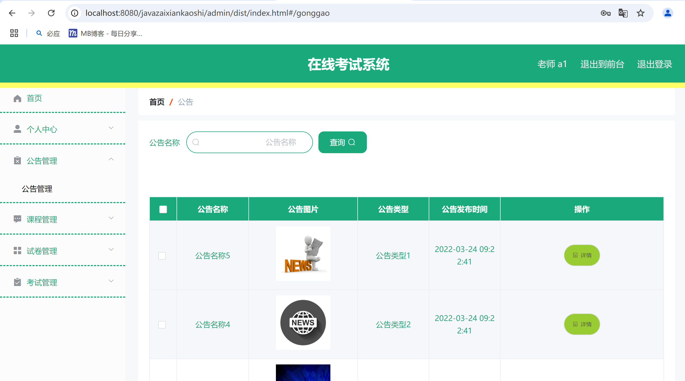

适合初学同学练手项目，部署简单，代码简洁清晰；

愿世界和平再无bug

# 一、系统架构

######      前端：vue| elementui

######      后端：springboot | mybatis-plus   

######      环境：jdk1.8+ | mysql | maven

# 二、登录角色

###### 1.管理员

###### 2.老师

###### 3.学生

# 三、代码及数据库

#

# 四、相关功能介绍

#### 1.管理端

超管登录

###### (1).登录页

###### (2).首页

###### (3).修改密码

###### (4).班级管理

###### (5).公告类型管理

###### (6).课程类型管理

###### (7).科目管理

###### (8).公告管理

###### (9).课程管理

###### (10).课程留言管理

###### (11).课程收藏管理

###### (12).老师管理

###### (13).学生管理

###### (14).试卷管理

###### (15).试题管理

###### (16).考试记录

###### (17).轮播图管理

#### 2.老师端

###### (1).修改密码

###### (2).公告管理

###### (3).课程管理

###### (4).课程留言管理

###### (5).考试管理

###### (6).试卷管理

###### (7).考试记录

#### 3.学生端

###### (1).修改密码

###### (2).公告管理

###### (3).课程管理

###### (4).课程留言

###### (5).课程收藏管理

###### (6).考试管理

###### (7).考试记录

###### (8).错题本

#### 4.学生前台

(1).首页

(2).课题详情

(3).考试卷

(4).考试

(5).公告管理

(6).公告详情

(7).课程列表

###### (8).个人中心

(9).课程收藏

(10).考试记录

(11).错题本

